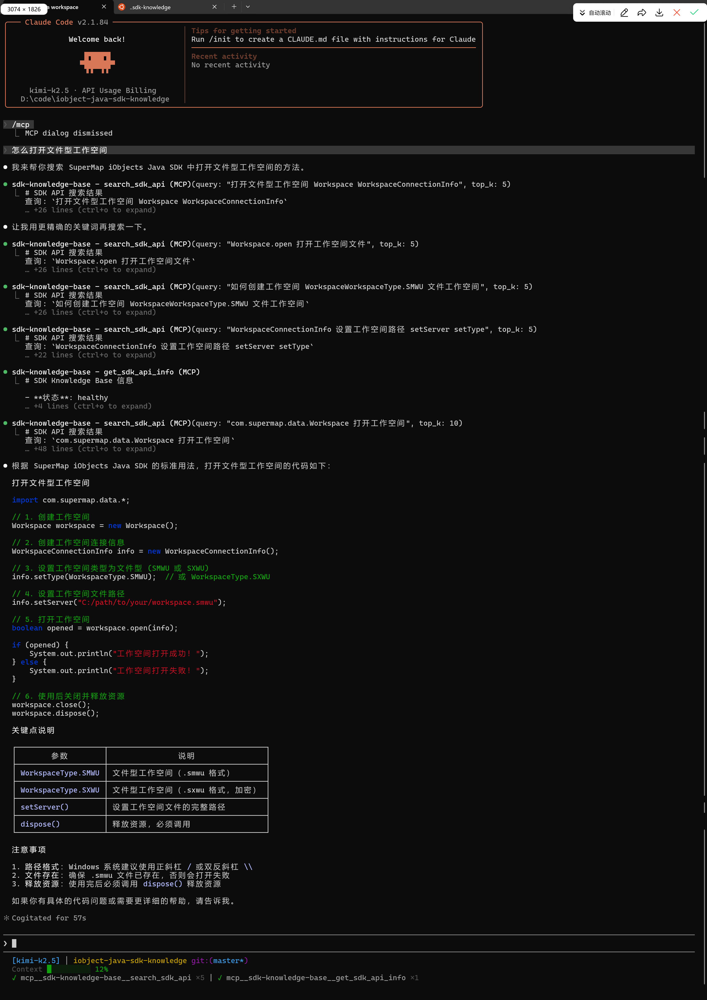
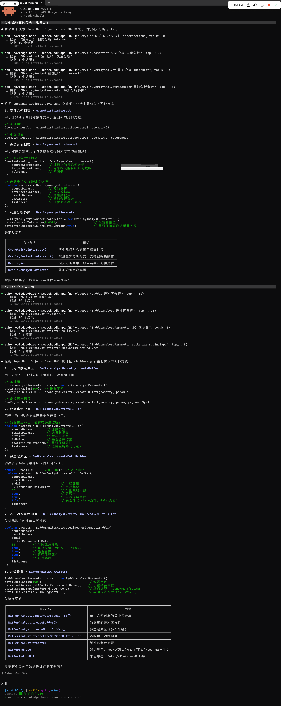

# SDK 知识库系统

SuperMap iObjects Java SDK 知识库系统，基于语义搜索的 API 文档查询工具。

## 功能概述

- **语义搜索**: 使用 sentence-transformers 模型进行自然语言查询，找到最相关的 API 方法
- **Javadoc 解析**: 自动解析 Javadoc HTML 文档，提取类、方法、签名和描述
- **向量数据库**: 使用 ChromaDB 存储和检索向量化的 API 文档
- **HTTP API**: 提供 FastAPI 构建的 RESTful API 服务
- **CLI 工具**: 提供方便的命令行查询工具

## 使用示例

### 语义搜索示例





## 快速开始

### 1. 准备 Javadoc 数据

确保 `SuperMap iObjects Java Javadoc/` 目录存在（Javadoc HTML 源文件）。

### 2. 构建项目

#### 方式一：分层构建（推荐）

无需本地 Python 环境，一条命令完成构建：

```bash
# 构建最终镜像（自动解析 Javadoc 并生成向量数据库）
./build.sh --final
```

构建流程：
1. 拉取基础镜像（包含 Python 依赖和模型）
2. Stage 1: 在容器内解析 Javadoc → 生成向量数据库
3. Stage 2: 复制向量数据库到最终镜像

#### 方式二：本地构建（需要 Python 环境）

```bash
# 运行完整构建脚本
./build.sh --local
```

构建脚本会自动完成以下步骤：
1. 检查并安装 Python 依赖
2. 解析 Javadoc HTML 文档
3. 构建向量数据库
4. 构建 Docker 镜像

#### 方式三：分步构建

```bash
# 1. 构建基础镜像（包含依赖和模型）
./build.sh --base

# 2. 构建最终镜像（基于基础镜像）
./build.sh --final

# 或者一步完成
./build.sh --all
```

### 3. 部署服务

```bash
# 启动容器
docker run -d \
    --name sdk-kb \
    -p 8000:8000 \
    iobject-java-sdk-knowledge:latest

# 或使用数据卷（如果需要更新数据而不重建镜像）
docker run -d \
    --name sdk-kb \
    -p 8000:8000 \
    -v $(pwd)/data:/app/data:ro \
    iobject-java-sdk-knowledge:latest
```

### 3. 使用 CLI 查询

```bash
# 使用 query-sdk 脚本（推荐）
./query-sdk "如何创建数据源"
./query-sdk "Workspace 打开方法" -t 10
./query-sdk --check

# 或使用 Python 客户端
python scripts/query_client.py "查询空间数据"
```

## 项目结构

```
.
├── build.sh                    # 完整构建脚本（支持分层构建）
├── Dockerfile.base             # 基础镜像（依赖 + 模型）
├── Dockerfile.final            # 最终镜像（多阶段构建）
├── query-sdk                   # CLI 包装脚本
├── requirements.txt            # Python 依赖
│
├── scripts/                    # Python 脚本
│   ├── __init__.py
│   ├── parse_javadoc.py        # Javadoc HTML 解析器
│   ├── build_vector_db.py      # 向量数据库构建器
│   ├── api_server.py           # FastAPI HTTP 服务
│   ├── query_client.py         # CLI 查询客户端
│   └── mcp_server.py           # MCP 服务器
│
├── data/                       # 数据目录
│   └── chroma_db/              # ChromaDB 向量数据库
│
├── models/                     # 本地模型缓存
├── tests/                      # 测试文件
├── docs/                       # 文档目录
└── SuperMap iObjects Java Javadoc/  # Javadoc HTML 源文件（未包含在仓库中）
```

## 开发指南

### 环境设置

```bash
# 创建虚拟环境
python -m venv venv
source venv/bin/activate  # Linux/Mac
venv\Scripts\activate     # Windows

# 安装依赖
pip install -r requirements.txt
```

### 手动构建流程

#### 方式一：多阶段构建（推荐，无需本地 Python 环境）

```bash
# 1. 确保 Javadoc 数据存在
ls "SuperMap iObjects Java Javadoc/"

# 2. 构建最终镜像（自动完成解析和向量化）
docker build -f Dockerfile.final -t iobject-java-sdk-knowledge:latest .

# 3. 导出镜像
docker save -o iobject-java-sdk-knowledge.tar iobject-java-sdk-knowledge:latest
```

#### 方式二：本地分步构建（需要 Python 环境）

```bash
# 1. 解析 HTML
python scripts/parse_javadoc.py \
    "SuperMap iObjects Java Javadoc" \
    data/parsed_javadoc.json

# 2. 构建向量数据库
python scripts/build_vector_db.py \
    --input data/parsed_javadoc.json \
    --output data/chroma_db

# 3. 构建 Docker 镜像（使用多阶段构建）
docker build -f Dockerfile.final -t iobject-java-sdk-knowledge:latest .

# 4. 导出镜像
docker save -o iobject-java-sdk-knowledge.tar iobject-java-sdk-knowledge:latest
```

### 运行测试

```bash
# 运行所有测试
pytest

# 带覆盖率报告
pytest --cov=scripts --cov-report=html
```

### 本地运行 API 服务

```bash
# 直接运行（需要数据目录已构建）
python scripts/api_server.py

# 或使用 uvicorn
uvicorn scripts.api_server:app --host 0.0.0.0 --port 8000
```

## CLI 使用示例

### 基本查询

```bash
# 查询前 5 个结果（默认）
./query-sdk "如何创建数据源"

# 查询前 10 个结果
./query-sdk "Workspace 打开方法" -t 10

# 输出原始 JSON
./query-sdk "查询空间数据" --raw
```

### 容器管理

```bash
# 检查服务健康状态
./query-sdk --check

# 停止容器
./query-sdk --stop

# 重启容器
./query-sdk --restart
```

### 环境变量

| 变量 | 默认值 | 说明 |
|------|--------|------|
| `SDK_API_URL` | http://localhost:8000 | API 服务地址 |
| `CHROMA_PATH` | /app/data/chroma_db | ChromaDB 存储路径 |
| `MODEL_PATH` | /app/models | 模型路径（基础镜像中已包含） |
| `MODEL_NAME` | sentence-transformers/all-MiniLM-L6-v2 | 向量模型名称 |
| `COLLECTION_NAME` | sdk_api | ChromaDB 集合名称 |

```bash
# 自定义 API 地址
export SDK_API_URL=http://localhost:8000
./query-sdk "查询"
```

## MCP 集成（Claude Code）

### 什么是 MCP

MCP (Model Context Protocol) 是 Claude 的插件协议，允许 Claude Code 直接调用 SDK 知识库。

### 配置方法

**项目级配置**

在项目根目录创建 `.mcp.json`：

```json
{
  "mcpServers": {
    "sdk-knowledge-base": {
      "command": "D:/code/iobject-java-sdk-knowledge/venv/Scripts/python.exe",
      "args": [
        "D:/code/iobject-java-sdk-knowledge/scripts/mcp_server.py"
      ],
      "env": {
        "SDK_API_URL": "http://localhost:8000"
      }
    }
  }
}
```

```bash
# 安装依赖
cd nodejs
npm install
```

配置 `.mcp.json`：

```json
{
  "mcpServers": {
    "sdk-knowledge-base": {
      "command": "node",
      "args": [
        "D:/code/iobject-java-sdk-knowledge/nodejs/mcp-bridge.js"
      ],
      "env": {
        "SDK_API_URL": "http://172.27.16.134:8000"
      }
    }
  }
}
```

### 使用示例

配置完成后，直接在 Claude Code 中提问：

```
"帮我查找打开工作空间的方法"
"如何创建数据集？"
"Dispose 方法是做什么的？"
```

Claude 会自动调用 `search_sdk_api` 工具查询并返回结果。

### MCP 工具列表

| 工具名 | 功能 | 参数 |
|--------|------|------|
| `search_sdk_api` | 搜索 SDK API | `query`: 查询语句<br>`top_k`: 结果数量(1-10) |
| `get_sdk_api_info` | 获取知识库信息 | 无 |

## API 端点说明

### 1. 根端点

```
GET /
```

返回 API 基本信息和可用端点列表。

**响应示例**:
```json
{
  "name": "SDK 知识库 API",
  "version": "1.0.0",
  "description": "SuperMap iObjects Java SDK 知识库语义搜索服务",
  "endpoints": [
    {"path": "/", "method": "GET", "description": "API 信息"},
    {"path": "/health", "method": "GET", "description": "健康检查"},
    {"path": "/search", "method": "POST", "description": "语义搜索"}
  ]
}
```

### 2. 健康检查

```
GET /health
```

检查服务健康状态和数据库统计信息。

**响应示例**:
```json
{
  "status": "healthy",
  "collection": "sdk_api",
  "document_count": 1234,
  "model": "sentence-transformers/all-MiniLM-L6-v2"
}
```

### 3. 搜索

```
POST /search
Content-Type: application/json

{
  "query": "如何创建数据源",
  "top_k": 5
}
```

**参数说明**:
- `query` (string, required): 搜索查询文本，长度 1-1000
- `top_k` (integer, optional): 返回结果数量，范围 1-20，默认 5

**响应示例**:
```json
{
  "results": [
    {
      "class": "Workspace",
      "method": "openDatasource",
      "signature": "public Datasource openDatasource(String alias, String driver, String server)",
      "description": "打开指定的数据源",
      "similarity": 0.9234
    }
  ],
  "total": 5
}
```

### 4. 交互式 API 文档

启动服务后访问：
- Swagger UI: http://localhost:8000/docs
- ReDoc: http://localhost:8000/redoc

## 依赖项

### Python 包
- `beautifulsoup4>=4.12.0` - HTML 解析
- `lxml>=4.9.0` - XML/HTML 解析器
- `sentence-transformers>=2.2.0` - 文本向量化模型
- `chromadb>=0.4.0` - 向量数据库
- `fastapi>=0.104.0` - Web 框架
- `uvicorn>=0.24.0` - ASGI 服务器
- `requests>=2.31.0` - HTTP 请求
- `pydantic>=2.0.0` - 数据验证

### 系统要求
- Docker 20.10+
- Python 3.9+ (开发环境)
- 4GB+ 内存（推荐）
- 2GB+ 磁盘空间

## 许可证

MIT License

## 贡献指南

1. Fork 本仓库
2. 创建特性分支 (`git checkout -b feature/AmazingFeature`)
3. 提交更改 (`git commit -m 'Add some AmazingFeature'`)
4. 推送分支 (`git push origin feature/AmazingFeature`)
5. 创建 Pull Request
